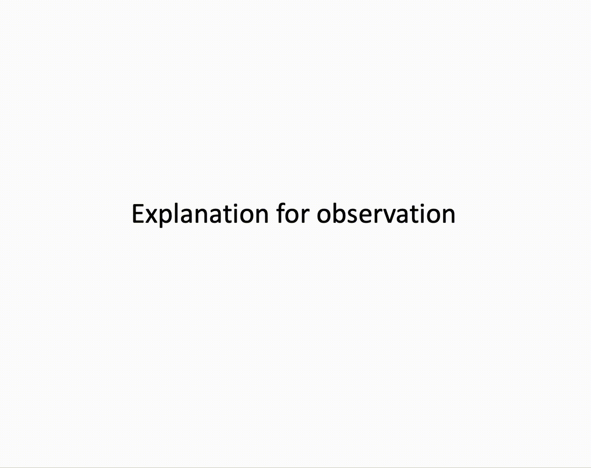
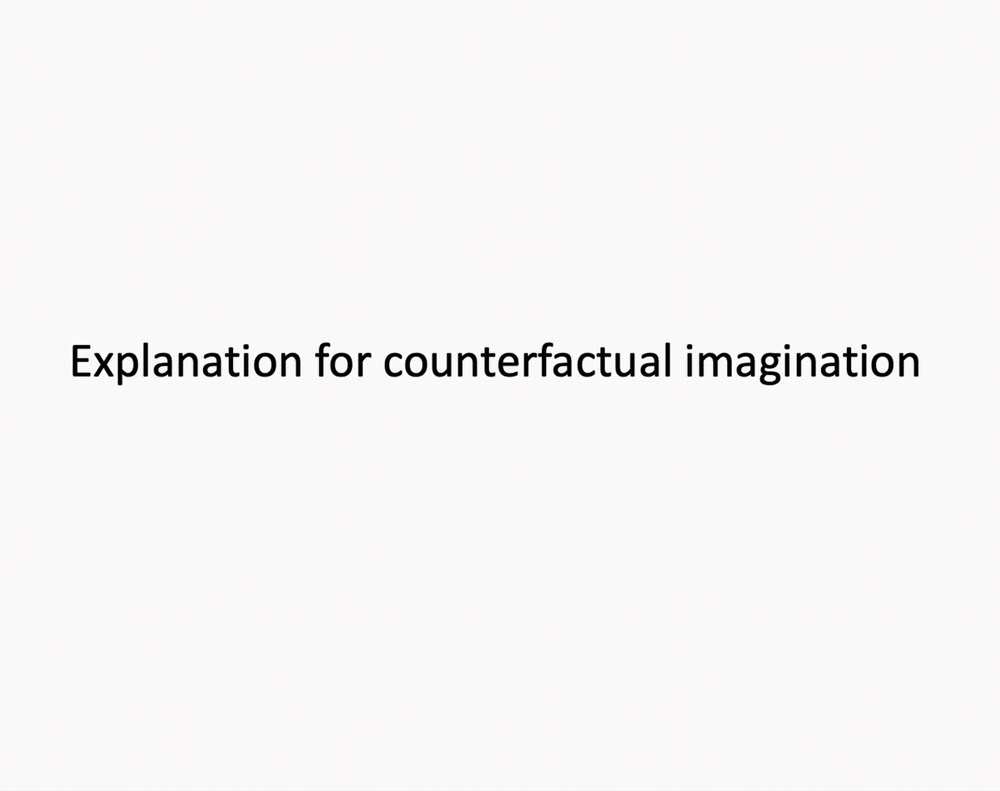

# EXPHY

## Introduction
This is the official PyTorch implementation for the paper: **EXPHY: Learning Explainable Intuitive Physics in Neural Networks**. This repository contains:
- pre-trained model
- Visual demos of **counterfactual imagination**:
  1. Collision: _1. What if the cylinder is heavier?_; _2. What if the sphere is heavier?_
  2. Coulomb interaction: _1. What if the objects are uncharged?_; _2. What if the objects undergo repulsion?_
- Inference code for physical event **explanation**

## Visualization Demos
### Explain observation
<!Observation| Reconstruction | Counterfactual 1 | Counterfactual 2
:--------------------------------------------------:|:--------------------------------------------------: |:--------------------------------------------------: |:--------------------------------------------------: 
  |   |  |  
|| |
  |   |  | >

### Explian counterfactual imagination


## Requirements
- Python 3.6.9
- CUDA 11.0
- Others (See requirements.txt)
  
## Installation 
```
conda create -n exphy python=3.6.9
conda activate exphy
git clone https://github.com/tqace/EXPHY.git && cd EXPHY
pip -r requirments.txt
```
## Explanation inference
The commands output force analyses which encompasses three specific parameters: Velocity, Collision Acceleration, and Coulomb Acceleration:
```
python explain.py --scenario collision
python explain.py --scenario charge
```

