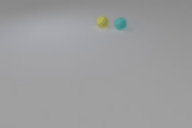

# EXPHY
**EXPHY: Learning Explainable Intuitive Physics in Neural Networks**

Observation| Reconstruction | Counterfactual 1 | Counterfactual 2
:--------------------------------------------------:|:--------------------------------------------------: |:--------------------------------------------------: |:--------------------------------------------------: 
  |   |  |  
|| |
  |   |  |  
