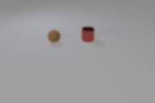
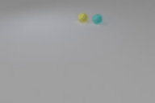

# EXPHY

## Introduction
This is the official PyTorch implementation for the paper: **EXPHY: Learning Explainable Intuitive Physics in Neural Networks**. The code contains:
- pre-trained model
- Visual demos of **counterfactual imagination** for two types (Collision and Coulomb interaction) of physical events
- Inference code for physical event **explanation**

## Visualization Demos
Observation| Reconstruction | Counterfactual 1 | Counterfactual 2
:--------------------------------------------------:|:--------------------------------------------------: |:--------------------------------------------------: |:--------------------------------------------------: 
  |   |  |  
|| |
  |   |  |  

## Requirements
- Python 3.6+
- CUDA 11.0+
- Others (See requirements.txt)
  
## Installation 
